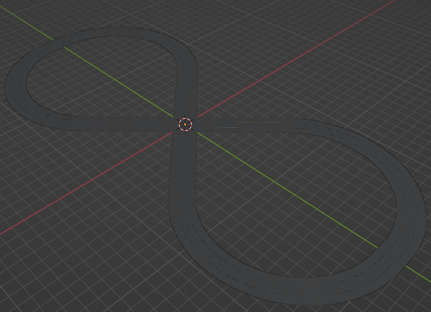
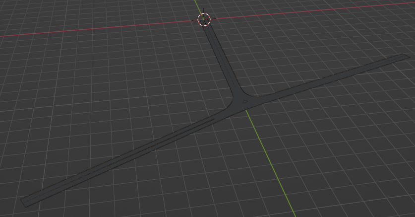

# roadGen
Import OpenDRIVE roads into Blender as 3D meshes. This repository is based on the [libOpenDRIVE](https://github.com/grepthat/libOpenDRIVE). 

# Quick Start
Assuming that you are using a Windows machine and Blender is installed and you are able to run the `blender --python` command from your command prompt/terminal:
- Run the command `cd libOpenDRIVE && workflow`. This will create the executable for libOpenDRIVE library. 
- Run `genobj.bat`. This will run the opendrive parser library executable for a default `test.xodr` file and run the Blender python command to import the generated .obj files into Blender. 
- Uncomment the line `bpy.ops.export_scene.fbx(filepath=argv[2], axis_forward='X', axis_up='Z', embed_textures=True)` and add another argument inside `genobj.bat` script after the `--` to export the entire road to an FBX file. 
Here are some outputs:

# Further work
- Once you have the OpenDRIVE and the corresponding FBX files, you can import them into CARLA simulator. I wrote a step-by-step guide to do so [here](https://github.com/johschmitz/blender-driving-scenario-creator/issues/23)
- You can further generate .xodr files using python by referring to the [scenariogeneration](https://github.com/pyoscx/scenariogeneration) library. 

