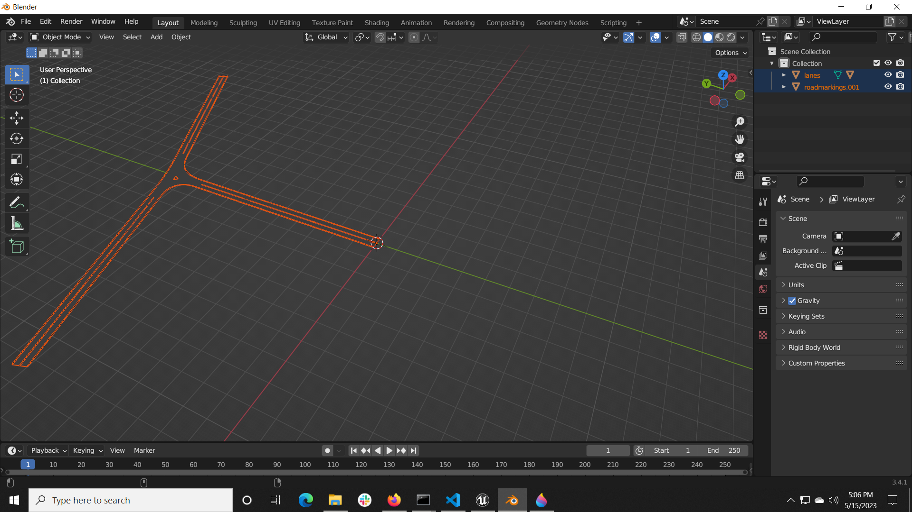
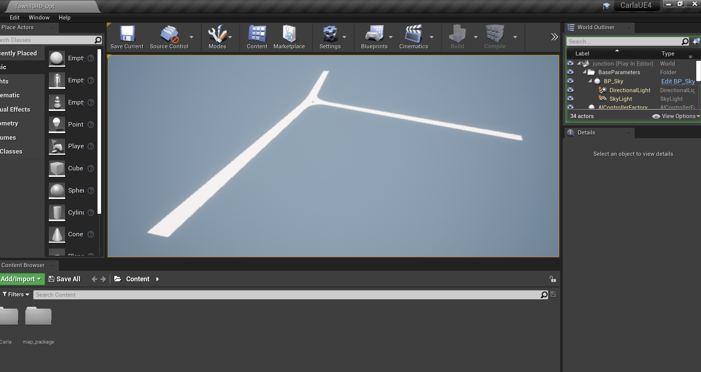

# An OpenDRIVE static scenario file importer for Blender
Import OpenDRIVE roads into Blender as 3D meshes. This repository is based on the [libOpenDRIVE](https://github.com/grepthat/libOpenDRIVE). 

# Quick Start
Assuming that you are using a Windows machine and Blender is installed and you are able to run the `blender --python` command from your command prompt/terminal:
- Create a python environment with python 3.8 and where `pip install scenariogeneration` is done.
- Run `python odrgen.py`. This will generate the `junction.xodr` file in the libOpenDRIVE directory using the `scenariogeneration` python package.
- Run `genobj.bat`. This will run the opendrive parser library executable for a default `junction.xodr` file and run the Blender python command to import the generated .obj files into Blender. It will also generate the .fbx files in the project directory. 
Here are some outputs:

# Procedurally generated environments directly for CARLA simulator
Assuming you have Blender installed and you are able to run the `blender --python` command from your command prompt/terminal and have installed CARLA simulator from source (0.9.14) on Windows with python 3.8 (since for this python version, the python module is available via Pypi)

- Open a `x64` command prompt. Run `make launch` to start the simulator. When the Unreal Editor opens, click the `play` button. If this isn't working, make sure your CARLA installation is correct. 
- Open a new `x64` command prompt.
- Create a python environment with Python 3.8 and ensure that `import carla` works. If it doesn't, install the python package directly using `python -m pip install carla`. 
- As written in the quick start before, run `python odrgen.py` to generate OpenDRIVE .xodr files and `genobj.bat` to generate 3D meshes for the same road via Blender.   
- Run `carlaimport.bat`.
- Check if map is imported into CARLA.

Here's a procedurally generated 3 way intersection generated in `odrgen.py` in Blender and CARLA:

# Further work
- You can further generate .xodr files using python by referring to the [scenariogeneration](https://github.com/pyoscx/scenariogeneration) library or by modifying the `odrgen.py` script.
- You can further generate the larger 3D scene beyond the road (road signs, trees, fences, buildings) using the Blender python API by modifying the `import.py` script.
- You can also manually import the map into CARLA. I wrote a step-by-step guide to do so [here](https://github.com/johschmitz/blender-driving-scenario-creator/issues/23)
- Once you have imported the map into CARLA, you can develop the python scripting using the CARLA python API or use the CARLA scenario runner to run traffic in the scene.

